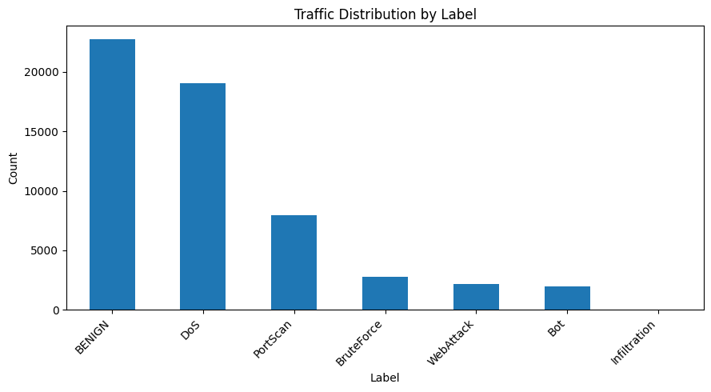
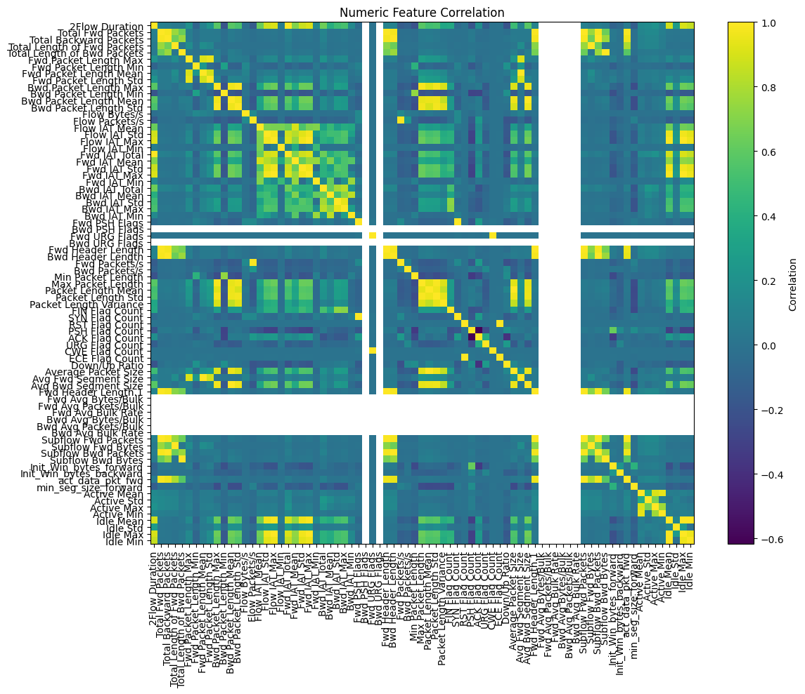

# Cybersecurity Network Traffic Analysis

Exploratory Data Analysis (EDA) project using network traffic data to identify traffic patterns, attack distributions, statistical characteristics, outliers, and relationships between network features.

This repository is developed as a practical Data Analyst exercise using a cybersecurity dataset.

## Project Overview

The analysis focuses on understanding network traffic and identifying patterns between benign and malicious traffic.

The initial version of this project is implemented using standard Pandas, NumPy, and Matplotlib operations without a custom analysis toolkit.

A second version of the analysis introduces a reusable Python snippets toolkit to simplify repetitive Data Analyst tasks.

## Dataset

**Dataset:** CICIDS2017 Sample

The dataset contains network flow information with multiple numerical network features and a `Label` column representing traffic categories.

Example labels include:

- BENIGN
- DoS
- PortScan
- BruteForce
- WebAttack
- Bot
- Infiltration

The dataset is included in this repository for reproducibility.

See [`data/README.md`](data/README.md) for dataset information and source.

## Analysis Workflow

The notebooks follow a practical EDA workflow:

1. Data loading
2. Dataset inspection
3. Data quality checking
4. Duplicate analysis
5. Missing-value analysis
6. Traffic distribution analysis
7. Attack distribution analysis
8. Statistical analysis
9. Outlier analysis
10. Correlation analysis
11. Data visualization
12. Key findings

## Results

The analysis explores:

- Distribution between benign and attack traffic
- Distribution of different attack categories
- Statistical characteristics of network-flow features
- Potential outliers using the IQR method
- Relationships between numerical network features
- Correlations between network-flow features

### Traffic Distribution

### Numeric Feature Correlation

## Tools

- Python
- Pandas
- NumPy
- Matplotlib
- Jupyter Notebook

## Project Versions

### Version 1 — Manual EDA

The initial analysis is performed using standard Python and Pandas operations to demonstrate understanding of the underlying Data Analyst workflow and syntax.

Notebook:

[`cybersecurity-data-analysis.ipynb`](notebooks/cybersecurity-data-analysis.ipynb)

### Version 2 — Reusable Snippets

The second version introduces `snippets_v2.py`, a reusable toolkit for common data analysis tasks such as:

- Dataset inspection
- Missing-value analysis
- Duplicate analysis
- Frequency analysis
- GroupBy statistics
- Outlier detection
- Correlation analysis
- Data visualization

Notebook:

[`cybersecurity-data-analysis-snippets.ipynb`](notebooks/cybersecurity-data-analysis-snippets.ipynb)
